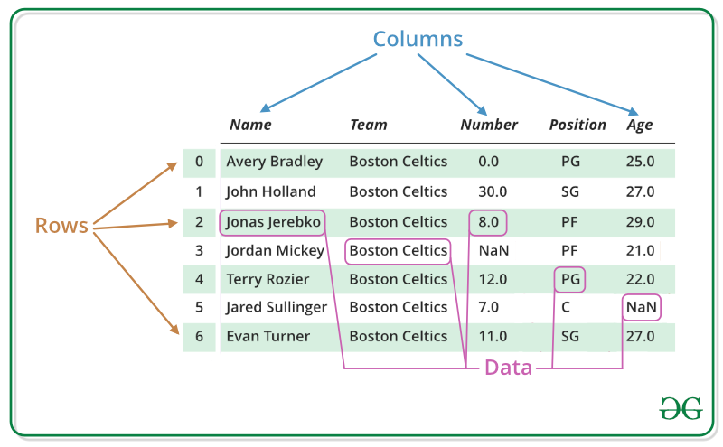

```{r setup, include=FALSE}
knitr::opts_chunk$set(echo = TRUE)
```

# Table of Content

1. What is Data Frame?
1. Creating Data Frame
1. Exploring Data Frame
1. Displaying Data Frame
1. Summarizing Data Frame
1. Selecting Data from Data Frame
1. Returning Data Frame vs Vectors
1. More Fun with Data Frame!

## 1. What is Data Frame?

A data frame is a two-dimensional data structure in R language, consisting of rows and columns. It is a special type of List data structure.



Picture Source: https://www.geeksforgeeks.org/dataframe-operations-in-r/

## 2. Creating Data Frame

### Creating Data Frame from Vectors

A data frame can be created from vectors using the c() function to combine data items of the same type. In the example below, a data frame is created from a character vector, a numeric vector, and a date vector.

```{r}
members <- data.frame(
  Name = c('Ricky', 'Fatimah', 'Kumanan', 'Jamaine'), # Character vector
  Height = c(170, 172, 180, 168), # Numeric vector
  Birthday = as.Date(c('1990-01-01', '1991-02-02', '1993-03-03', '1994-04-04')) # Date vector
)

print(members)
```

### Creating Data Frame from Lists

A data frame can be created by converting from lists.

```{r}
list_numbers <- list('Column 1' = 1:4, 'Column 2' = 5:8, 'Column 3' = 9:12)
df_numbers <- as.data.frame(list_numbers)
df_numbers
```

### Creating Data Frame from Matrix

A data frame can be created by converting from a matrix.

```{r}
matrix_numbers <- matrix(1:12, nrow = 4, ncol = 3)
df_numbers <- as.data.frame(matrix_numbers)
colnames(df_numbers) <- c('Column 1', 'Column 2', 'Column 3') # Assign column names
df_numbers
```

### Creating Data Frame from File

A data frame can be created by importing data from a file or on the web, such as a comma-separated values (CSV) file using the read.csv() function.

```{r}
# Import from a CSV file on local computer
audiobooks <- read.csv('audiobooks.csv')

# Import the same CSV file from the web
audiobooks <- read.csv('https://raw.githubusercontent.com/rickysoo/top_audiobooks/main/TopAudiobooks-20201107-122322.csv')

head(audiobooks) # Show first 6 rows
```

## 3. Exploring Data Frame

There are a number of functions to show the characteristics of a data frame.

```{r}
# Data frame is a special case of list
typeof(members)

# The class is data.frame
class(members)

# Check if "members" is a data frame
is.data.frame(members)

# Number of columns
ncol(members)

# Column names
names(members)

# Number of rows
nrow(members)

# Row names
row.names(members)

# The dimension
dim(members)

# The row and column names
dimnames(members)

# Internal structure of the data frame
str(members)
```

## 4. Displaying Data Frame

A number of functions can be used to show the whole or part of the data frame in order to examine the data.

```{r}
print(members) # Print the whole data frame
```
```{r}
View(members) # View the data frame in data viewer in RStudio
```

```{r}
head(audiobooks, n = 3) # Show the first 3 rows of the data frame. The default is 6 rows.
```

```{r}
tail(audiobooks, n = 3) # Show the last 3 rows of the data frame. The default is 6 rows.
```

The "dplyr" library provides some useful functions for data frame.

```{r}
library(dplyr)

sample_n(audiobooks, size = 3) # Sample 3 rows randomly from the dataframe

sample_frac(audiobooks, size = 0.05) ## Sample 5% of the rows randomly from the dataframe
```

## 5. Summarizing Data Frame

A summary of the data frame can be shown using the summary function. For character variables, it shows the mode among others. For numeric and date variables, it shows the mean, the minimum, the maximum, the median and the quartiles.

```{r}
summary(members)
```

## 6. Selecting Data from Data Frame

### Selecting Cell(s)

Select a single cell from a data frame by using the row and column indexes.

```{r}
data <- members[1, 1] # Row 1, column 1
print(data)
```
Select multiple cells from a data frame by using the row and column indexes.

```{r}
data <- members[1:2, 1:2] # Rows 1 and 2, columns 1 and 2
print(data)
```

Column names can be used in selecting the columns.

```{r}
data <- members[1:2, c('Name', 'Height')] # Rows 1 and 2, columns "Name" and "Height"
print(data)
```
### Selecting Row(s)

Select a single row from a data frame by using the row index.

```{r}
data <- members[1, ] # Row 1
print(data)
```
Select multiple rows from a data frame by using the row numbers.

```{r}
data <- members[1:2, ] # Rows 1 and 2
print(data)
```
```{r}
data <- members[c(1, 3), ] # Rows 1 and 3
print(data)
```
### Selecting Column(s)

Select a single column from a data frame by using the column index.

```{r}
data <- members[ , 1] # Column 1
print(data)
```
Select multiple columns from a data frame by using the column indexes.

```{r}
data <- members[ , 1:2] # Columns 1 and 2
print(data)
```

```{r}
data <- members[, c(1, 3)] # Columns 1 and 3
print(data)
```

Column names can be used in selecting the columns.

```{r}
data <- members[ , c('Name', 'Birthday')] # Columns "Name" and "Birthday"
print(data)
```

A column can be selected using the column name in bracket.

```{r}
data <- members['Name']
print(data)
```
### Selecting Using Logical Vectors

Data can be selected using logical vectors.

```{r}
data <- members[c(T, F, T, F), c(T, T, F)] # Select rows 1 and 3, and columns 1 and 2
print(data)
```

### Selecting Using $ Operator

A column can be selected using the format dataframe#column.

```{r}
data <- members$Name
print(data)
```

### Selecting Based on Condition

Data can be conditionally selected by including a condition in bracket.

```{r}
data <- members[members$Height > 170, ] # Show members with height more than 170cm
data
```

Data can be conditionally selected by using the subset() function.

```{r}
data <- subset(members, members$Height > 170) # Show members with height more than 170cm
data
```

## 7. Returning Data Frame vs Vector

When single brackets [] are used, the data is returned as a dataframe.

When double brackets [[]] and $ are used, the data is returned as a vector.

```{r}
data <- members[1]
class(data) # Returns data frame
```

```{r}
data <- members[[1]]
class(data) # Returns vector
```

```{r}
data <- members['Name']
class(data) # Returns data frame
```
```{r}
data <- members[['Name']]
class(data) # Returns vector
```
```{r}
data <- members$Name
class(data) # Returns vector
```
The "drop = FALSE" argument can be used to return a data frame instead of a vector.

```{r}
data <- members[, 1] # By default, drop = TRUE
is.vector(data)
is.data.frame(data)
class(data) # Returns vector
```
```{r}
data <- members[, 1, drop = FALSE] # Set drop = FALSE
is.vector(data)
is.data.frame(data)
class(data) # Returns data frame
```

## 8. More Fun with Data Frame!

Data can be sorted using the order() function given a column name.

```{r}
height_order <- order(members$Height)
print(height_order)
members[height_order, ]
```

Quickly visualize the data in a data frame using the plot function!

```{r}
plot(members)
```

Don't forget to save any updated data frame to a CSV file by using the write.csv() function.

```{r}
write.csv(members, 'members.csv')
```

## And finally, it's....


Picture Source: https://www.pexels.com